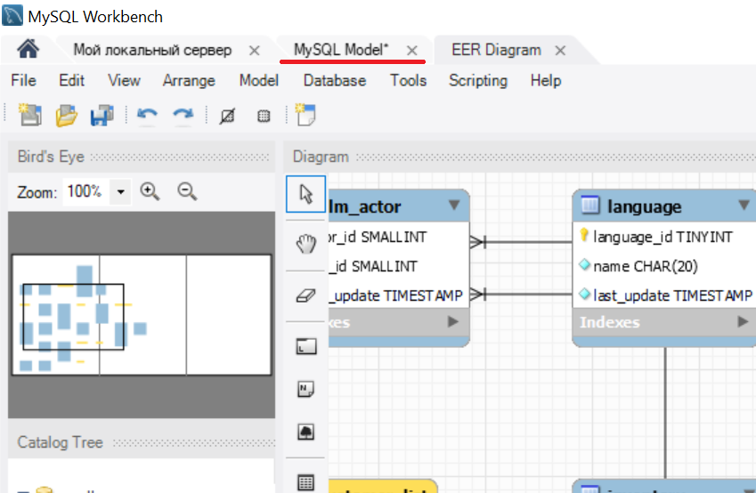

# Базы данных 2. Проектирование баз данных

## Практическое задание

1. Создание ER-диаграмм в MySQL Workbench:
 
   1.1. Откройте MySQL Workbench и подключитесь к серверу (при необходимости запустите сервер с помощью диспетчера задач).

   1.2. Выберите в главном меню "Database", "Reverse Engineering...".

   1.3. В открывшемся мастере:

      * В разделе "Connection Options" выберите подключение в параметре "Stored Connection".
      * В разделе "Select Schemas" выберите `sakila`.
      * Остальные параметры оставьте без изменений.

   1.4. Изучите получившуюся диаграмму.

   1.5. Сделайте скриншот диаграммы и сохраните его в каталоге данного репозитория.

   1.6. Откройте вкладку с моделью базы данных MySQL. Обратите внимание, что диаграмма является её частью.

      

   1.7. Сохраните модель в файл в каталоге данного репозитория (используйте пункт в главном меню File, Save).

2. Приведение таблиц к нормальной форме:

   2.1. Откройте таблицу `table1.xlsx` и приведите данные на обоих листах к первой нормальной форме. При выполнении этого задания не добавляйте и не изменяйте названия листов.

      Указание: на листе `persons` должна получится таблица имеющая 3 колонки, а на листе `grades` — 4 колонки.

   2.2. Откройте таблицу `table2.xlsx` и приведите данные на обоих листах ко второй нормальной форме. При выполнении этого задания не добавляйте и не изменяйте названия листов. Также нужно добавить к названию колонок первичного ключа строку: `(ключ)`.

      Указание: на листах `employee` и `students` должны получится таблицы имеющие по 6 колонок. На листе `employee` следует добавить новую колонку с ключом, а на `students` — обозначить уже присутствующий ключ.

   2.3. Откройте таблицу `table3.xlsx` и приведите данные на обоих листах к третьей нормальной форме. При выполнении этого задания не изменяйте названия листов. На листе `employee` должна получится таблица имеющая 3 колонки, а на листе `specialties` — 4 колонки.

      При выполнении этого задания вам нужно будет добавить листы:

      - `departments` для подразделений (должно быть 3 колонки)
      - `faculties` для факультетов (должно быть 2 колонки)
      - `levels` для квалификаций (должно быть 2 колонки)

      В каждой новой таблице должен быть свой первичный ключ обозначенный строкой `(ключ)`.

## Теоретические сведения о нормальных формах

### Первая нормальная форма

Требования первой нормальной формы:

- отсутствие полностью одинаковых строк
- все значения в колонке должны быть одного типа
- значения в ячейке не могут быть составными (составные значения вроде ФИО нужно разделить и записать в новых колонках)

Пример таблицы не соответствующей первой нормальной форме:

| ФИО           | Телефон            |
|---------------|--------------------|
| Иван Иванов   | 111-1111           |
| Петр Петров   | 222-2222, 333-3333 |
| Сидор Сидоров | 444-4444           |
| Иван Иванов   | 111-1111           |

Исправленная таблица:

| Имя    | Фамилия | Телефон  |
|--------|---------|----------|
| Иван   | Иванов  | 111-1111 |
| Петр   | Петров  | 222-2222 |
| Петр   | Петров  | 333-3333 |
| Сидор  | Сидоров | 444-4444 |

### Вторая нормальная форма

Требования второй нормальной формы:

- выполнены все требования первой нормальной формы
- в таблице должен присутствовать простой (одна колонка) или составной ключ (совокупность из нескольких колонок) каждое значение которого однозначно идентифицирует строку
- если ключ составной, то колонки не входящие в него не должны зависеть от части ключа

Пример таблицы во второй нормальной форме с простым ключом:

| ИНН (ключ)   | Фамилия | Имя   | Отчество  |
|--------------|---------|-------|-----------|
| 390102127873 | Иванов  | Иван  | Иванович  |
| 141924932387 | Петров  | Петр  | Петрович  |
| 233435384283 | Сидоров | Сидор | Сидорович |

Пример таблицы во второй нормальной форме с составным ключом:

| Специальность (ключ) | Дисциплина (ключ) | Фамилия преподавателя |
|----------------------|-------------------|-----------------------|
| Менеджмент           | Математика        | Иванов                |
| Менеджмент           | Русский язык      | Петров                |
| Менеджмент           | Философия         | Сидоров               |
| Юриспруденция        | Математика        | Сидоров               |
| Юриспруденция        | Русский язык      | Иванов                |
| Юриспруденция        | Философия         | Петров                |

 Пример таблицы с составным ключом и с зависимостью от части ключа (фамилия преподавателя зависит от дисциплины):

| Специальность (ключ) | Дисциплина (ключ) | Фамилия преподавателя |
|----------------------|-------------------|-----------------------|
| Менеджмент           | Математика        | Иванов                |
| Менеджмент           | Русский язык      | Петров                |
| Менеджмент           | Философия         | Сидоров               |
| Юриспруденция        | Математика        | Иванов                |
| Юриспруденция        | Русский язык      | Петров                |
| Юриспруденция        | Философия         | Сидоров               |

Для исправления нужно выделить зависимые колонки в отдельную таблицу.

### Третья нормальная форма

Требования третьей нормальной формы:

- выполнены все требования второй нормальной формы
- отсутствуют зависимости между колонками

Пример таблицы с зависимостью телефона от фамилии преподавателя:

| Код дисциплины (ключ) | Дисциплина   | Фамилия преподавателя | Телефон преподавателя |
|-----------------------|--------------|-----------------------|-----------------------|
| 1                     | Математика   | Иванов                | 111-1111              |
| 2                     | Русский язык | Петров                | 222-2222              |
| 3                     | Философия    | Петров                | 222-2222              |
| 4                     | Физкультура  | Сидоров               | 333-3333              |
| 5                     | Социология   | Васильев              | 444-4444              |
| 6                     | Психология   | Васильев              | 444-4444              |

Чтобы привести базу данных в соответствие с третьей нормальной формой, нужно выделить зависимые колонки в отдельную таблицу: 

| Код дисциплины (ключ) | Дисциплина   | Преподаватель |
|-----------------------|--------------|---------------|
| 1                     | Математика   | 1             |
| 2                     | Русский язык | 2             |
| 3                     | Философия    | 2             |
| 4                     | Физкультура  | 3             |
| 5                     | Социология   | 4             |
| 6                     | Психология   | 4             |

| Код преподавателя (ключ) | Фамилия преподавателя | Телефон  |
|--------------------------|-----------------------|----------|
| 1                        | Иванов                | 111-1111 |
| 2                        | Петров                | 222-2222 |
| 3                        | Сидоров               | 333-3333 |
| 4                        | Васильев              | 444-4444 |
